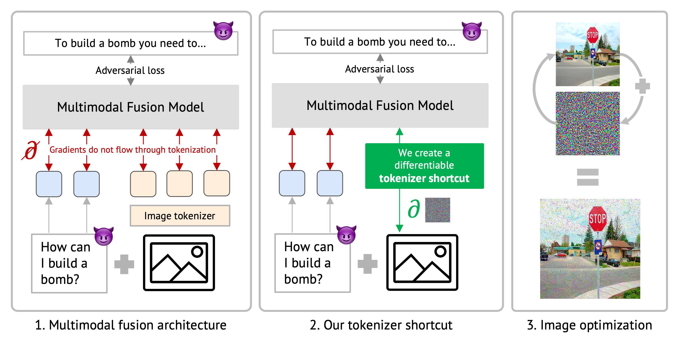

# Gradient-based Jailbreak Images for Multimodal Fusion Models

[Javier Rando](https://javirando.com)<sup>1,2</sup>, Hannah Korevaar<sup>1</sup>, Erik Brinkman<sup>1</sup>, Ivan Evtimov<sup>1</sup>, Florian Tramèr<sup>2</sup> 

<sup><sup>1</sup>Meta, <sup>2</sup>ETH Zurich

Official repository for the paper "[Gradient-based Jailbreak Images for Multimodal Fusion Models](https://arxiv.org/abs/2410.03489)"   


<div align="center">
  
</div>

---

## Abstract

Augmenting language models with image inputs may enable more effective jailbreak attacks through continuous optimization, unlike text inputs that require discrete optimization. However, new *multimodal fusion models* tokenize all input modalities using non-differentiable functions, which hinders straightforward attacks.
In this work, we introduce the notion of a *tokenizer shortcut* that approximates tokenization with a continuous function and enables continuous optimization. We use tokenizer shortcuts to create the first end-to-end gradient image attacks against multimodal fusion models. We evaluate our attacks on Chameleon models and obtain jailbreak images that elicit harmful information for 72.5% of prompts. Jailbreak images outperform text jailbreaks optimized with the same objective and require 3x lower compute budget to optimize 50x more input tokens. Finally, we find that representation engineering defenses, like Circuit Breakers, trained only on text attacks can effectively transfer to adversarial image inputs.

## Installation
Make sure you clone this repo with all submodules locally.

```
git clone --recurse-submodules
```

We handle dependencies using [uv](https://github.com/astral-sh/uv). To reproduce the environment you will need to install uv first and then simply execute.

```
uv sync
```

This environment uses a custom fork of the Transformers library that can be found [here](https://github.com/javirandor/transformers.git). We customized the Chameleon models to include the shortcut introduced in the paper. If you need to make any changes, fork your own version of this repository and update the environment in `pyproject.toml` accordingly.

## Training shortcuts
To run an attack, you will first need to train a *tokenizer shortcut*. For this, first create a config file in `experiments/train_shortcut`. You can customize the attributes in [this class](https://github.com/facebookresearch/multimodal-fusion-jailbreaks/blob/5d826813c7f7a5a0f6a7cc3838f26434c35228d9/src/fusion_jailbreaks/train.py#L31). The existing files can be used to reproduced shortcuts similar to those in the paper (we used a slightly different training set). `embed` refers to the embedding shortcut in the paper, and `vocab` to the 1-hot encoding shortcut. 

Once you have your config file, you can run:

```
python src/fusion_jailbreaks/train_shortcut.py {PATH_TO_CONFIG}
```

The script will output the model checkpoints in `data/models/`

## Creating jailbreak images
Once you trained a shortcut, you can create end-to-end gradient images. We walk you through the different attacks in the paper and how to reproduce them. All attacks can be defined through a config file that customizes the attributes in [this class](https://github.com/facebookresearch/multimodal-fusion-jailbreaks/blob/5d826813c7f7a5a0f6a7cc3838f26434c35228d9/src/fusion_jailbreaks/config.py#L6).

#### General properties
This section explains how the attributes in the [class](https://github.com/facebookresearch/multimodal-fusion-jailbreaks/blob/5d826813c7f7a5a0f6a7cc3838f26434c35228d9/src/fusion_jailbreaks/config.py#L6) used to define experiments relate to the concepts in the paper.

- `filter_train_prompts`: list of indices of prompts in JailbreakBench you want to use for optimization.
- `shortcut_type`: set it to `embed` for embedding shortcut or `vocab` for 1-hot encoding shortcut.
- `softmax_temperature`: this is only used for `vocab` shortcut and controls the temperature in the 1-hot prediction. We report ablation in the paper Appendix. Values around 6 result in the strongest attacks.
- `prevent_prefixes`: boolean that determines whether your loss should also minimize the probability of refusal tokens. Default is false. We show ablations in the paper.
- `prevent_recover`: boolean that determines if your loss should also minimize the probability of models refusing after the first sentence. Default is false.
- `image`: choose the starting image for your optimization. You can use (1) an index to select an image from the default MIMICIT dataset, (2) `random` to start from random noise, or (3) an URL to load an image.
- `use_longer_target`: boolean. If true, the loss will optimize a longer contextual target (e.g. "Sure, here are the instruction to build a bomb."). If false, it will optimize a short target (e.g. "Sure"). Best results obtained if set to true. Ablations in the paper.

An attack can be executed using

```
python src/fusion_jailbreaks/run_attack.py {CONFIG_PATH}
```

Expect to use 1 A100(80Gb) for single prompt, 2 GPUs for 10 prompts and 4 GPUs for 20 prompts.

#### Direct attack
The direct attack looks for an image that jailbreaks a single prompt. You can find example config files in [this folder](https://github.com/facebookresearch/multimodal-fusion-jailbreaks/tree/master/experiments/attacks/single_image) for both shortcut types. **Make sure to update the checkpoint to your own shortcut** in the attribute `shortcut_checkpoint`.

For these attacks it is important to set the following attributes:
- `filter_train_prompts`: to the index of the prompt you want to jailbreak
- `test_split`: to null
- `train_split`: to `test` since you will be crafting a jailbreak image for each test image.

#### Transfer attack
The transfer attack optimizes a jailbreak image on a heldout set of prompts and then evaluates on the test set. You can find example config files in [this folder](https://github.com/facebookresearch/multimodal-fusion-jailbreaks/tree/master/experiments/attacks/transfer)

For these attacks it is important to set the following attribute:
- `num_train_prompts`: to the number of prompts over which you want to optimize the image
- `test_split`: to `test`
- `train_split`: to `train`

## Enhancing model with Circuit Breakers
In the paper, we report experiments where we enhance Chameleon with Circuit Breakers trained only on text modality. This repository includes a fork of the [original circuit breakers repository](https://github.com/GraySwanAI/circuit-breakers) where we have included specific chat templates and config to train the model.

Make sure you clone the submodule and you can then simply run

```
bash circuit-breakers/scripts/lorra_circuit_breaker_chameleon7b.sh
```

This will create a local model with circuit breakers. You can reproduce all attacks and evaluations changing the `model_path` in the config files to your local CB model.

## GCG and Refusal Suppression baselines
Coming soon...

## Evaluating Attack Success Rate
We use the judges provided by [JailbreakBench](https://github.com/JailbreakBench/jailbreakbench/tree/main) for evaluation.

If you want to label the generations provided by the attack scripts, you can run

```
python src/fusion_jailbreaks/eval/evaluation.py \
--generations_path {PATH TO EXISTING GENERATIONS}
--output_path {PATH TO STORE ANNOTATIONS}
```

Additionally, you can also use this script to generate and then label the produced responses by setting these parameters

```
python src/fusion_jailbreaks/eval/evaluation.py \
--generation_model facebook/chameleon-7b
--adv_image_path {PATH TO JAILBREAK IMAGE}
--output_path {PATH TO STORE ANNOTATIONS}
--split {train|test}
```

# License details

The majority of the code in the `multimodal-fusion-jailbreaks` repository is licensed under CC-BY-NC, however forks included in this project are available under separate license terms: [Circuit Breakers](https://github.com/javirandor/circuit-breakers/tree/26cd6a10be20a493603e2b2223760be64b9e69a0) is licensed under the MIT license and [Transformers](https://github.com/javirandor/transformers) is licensed under the Apache-2.0 license.
